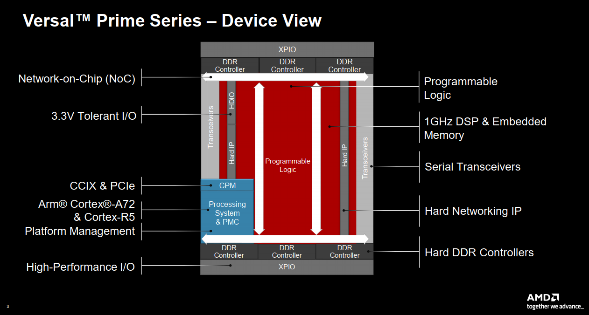

# 初识Versal

Xilinx 的器件命名方式具有传统，整体来说我们目前使用到了很多器件

* 28nm工艺：7系列器件
* 20nm UltraScale系列：KINTEX、VIRTEX
* 16nm UltraScale+&#x20;
* 7nm Versal系列
  * Versal Prime Series 基础 Versal™ 自适应 SoC 系列（基础和中端产品），主要特性是100G及200G联网设备，数据中心网络和加密存储、通信测试等，将主流的58G收发器和高速IO与DDR连接整合在一起，实现多种工作负载的低延迟加速和性能。
  * Versal Premium Series 在适应性强的平台上突破性地集成网络化、功耗优化的内核，适用于最具挑战性的计算和网络应用。此系列是专为超越高带宽、计算密集型有线通信、数据中心、测试测量等应用的需求而设计的。Versal Premium 系列包含 112G PAM4 收发器和集成块，适用于 600G 以太网、600G Interlaken、 PCI Express® Gen5 和高速加密技术。
  * Versal AI Edge Series 为功耗和散热受限的边缘应用提供出色的 AI 性能功耗比，加速预处理和 AI 推理。提高了整个应用的速度，包括传感器、AI 和实时控制装置，为它们提供了最高级别的安全性，让它们能够满足 ISO26262 和 IEC 61508 等关键标准。
  * Versal AI Core Series 通过 AI 引擎提供突破性的 AI 推理和无线加速，其计算性能比当今的服务器级 CPU 高出 100 倍以上，AI 和数据科学家以及软硬件开发者均可充分利用高计算密度的优势来加速提升任何应用的性能。
  * Versal HBM Series 具有快速内存、安全数据和自适应计算的超集成功能，适用于内存受限、计算密集型、高带宽应用程序。能够为数据中心、有线网络、测试测量、航空航天和国防等应用提供自适应加速。Versal HBM 系列集成了最先进的 HBM2e DRAM，可在单一器件内提供高存储器带宽和容量。

我们当前选用的器件是Versal Prime Series系列，型号为VM1402，对应官方开发板可以参考VMK180。

## Versal Prime Series - Device View

<figure><figcaption></figcaption></figure>

Versal器件对外所有的均为XPIO,可扩展高性能IO，用来连接外设，同时板内DDR控制器为硬核IP，不占用PL资源。芯片内所欲的互联均通过NoC进行互联，板载硬核可扩展的IP、以及高性能Serders。

上图中芯片内有一个专用的器件叫做Platform Management，这个是Soc启动引导的管理核心。

硬件Process System拥有着双核A72 处理器以及拥有 R5的高实时内核。

## Development Platforms for ALL Developers

<figure><figcaption></figcaption></figure>

Versal 器件因为有PLM存在，所以开发流程可以有很多种：

* PL Only
* HPS Only

对我们来说，我们是HPS First，即ARM硬核先启动,ARM启动后由ARM完成子卡内PL侧逻辑程序加载，同时ARM进行对自己程序的升级，升级方案需要进一步重新设计，争取做到对以太网带宽的充分利用。
